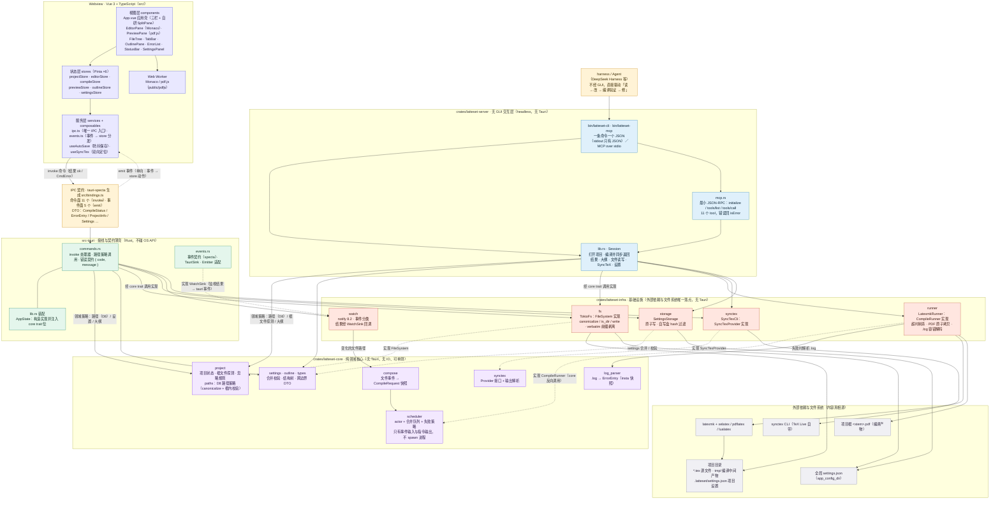
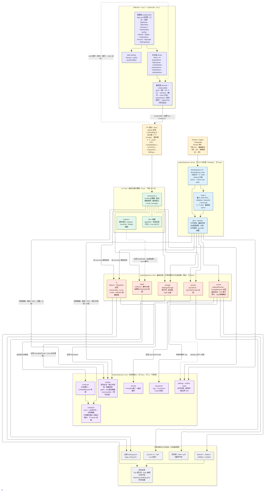
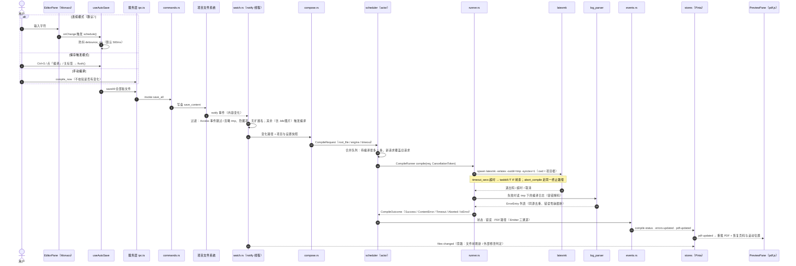
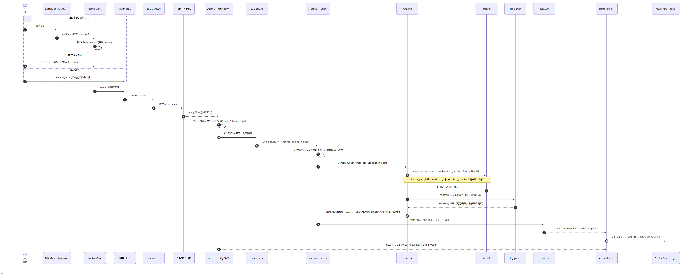
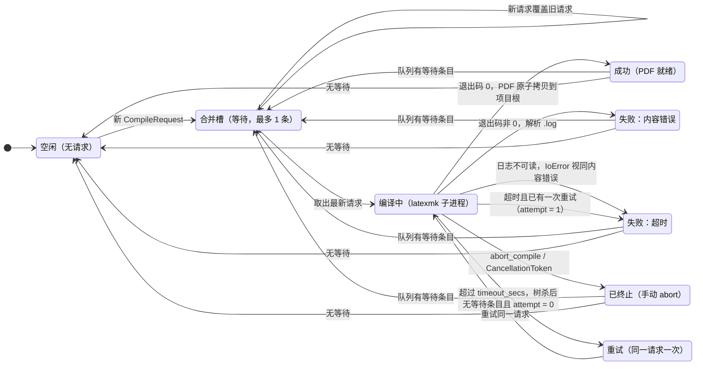
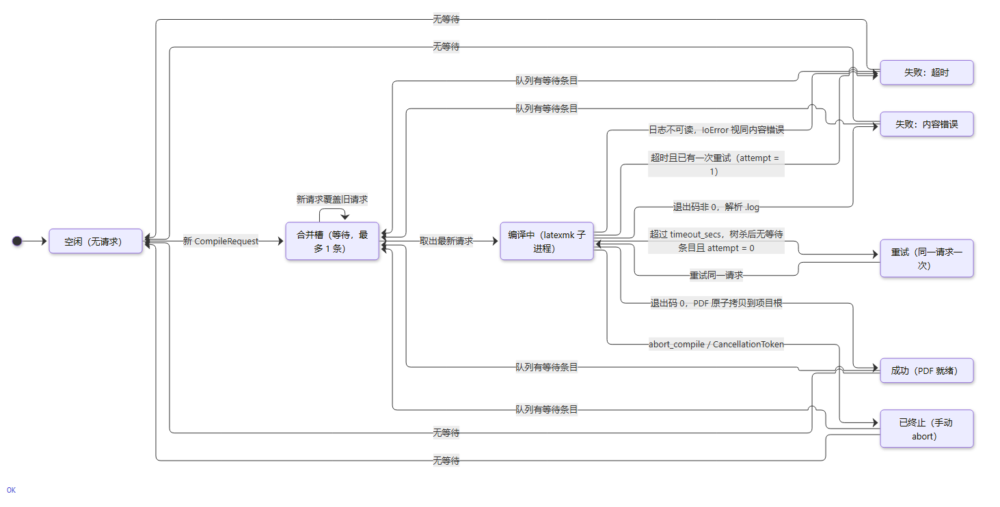
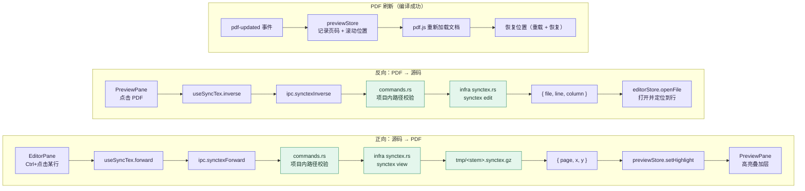
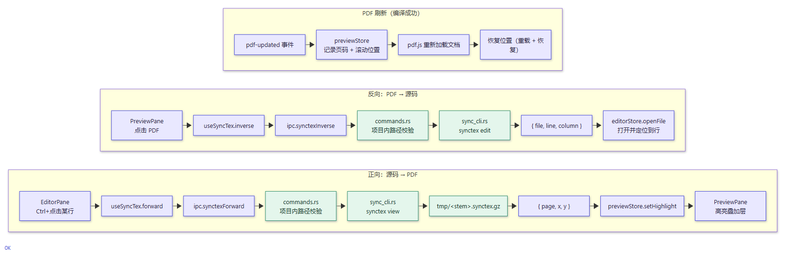

# Latteset 架构图（Mermaid）

> 本文件是 [architecture.md](./architecture.md) 的配套**图示**：把「分层与依赖 / 编译触发链路 / 调度器语义 / 编辑 ↔ 预览双向定位」四张图以 Mermaid 源码固化为事实来源。
> 图形随代码同步维护：**模块或链路一变，本文件与 architecture.md 一起改**（渲染与校验方式见文末 §5）。

## 1. 分层与依赖总览

依赖方向严格单向：`视图 → 状态 → 服务 → IPC 契约 → src-tauri（接线） → latteset-infra（基础设施） → latteset-core（领域）`。
接口在 core、实现在 infra、注入在 src-tauri：**core 不依赖 infra**（也不依赖 Tauri、不做 IO，ADR-0006）；**src-tauri 不碰 OS API**（文件与进程一律经 core trait，ADR-0010）。
**第二条入口（roadmap ⑥）**：`harness / Agent → latteset-server（CLI / MCP） → latteset-infra → latteset-core`——同样不碰 Tauri、不碰 OS API，与 GUI 并列而非上下级。

<!-- mermaid: 01-layers -->




**读图要点**

- **只有服务层碰 IPC**：视图与 store 不直接 invoke；命令与事件类型全部由 Rust 侧 specta 生成（`src/bindings.ts`，调试构建启动时刷新）。事件面与命令面共用一个边界：箭头向下为 invoke，虚线向上为 emit。
- **四个 Rust crate，两个"唯一落点"**：core 是唯一的**策略与接口**落点（队列语义、探测规则、D8 路径策略、trait 定义）；latteset-infra 是唯一的**外部依赖与文件系统**落点（tokio::fs、tokio::process、notify、设置落盘）。src-tauri 只做接线与契约（DTO、事件形态、装配注入）；latteset-server（⑥）是**与 src-tauri 并列的第二入口**——headless，不装配 scheduler/watch，不经 IPC 契约，直接调 core 策略 + infra 实现。
- **两条入口不互相认识**：GUI 走「前端 → IPC → src-tauri → infra → core」，headless 走「harness/Agent → server → infra → core」。二者**共用同一份**路径策略与 SyncTeX 实现（`core::synctex` / `core::project::paths`），但**不并发编译同一个项目**（会抢 `tmp/`，约定 headless 独占）。
- **core 零 IO**：进程、文件、监视、CLI 全在 infra；core 经 trait（`FileSystem` / `CompileRunner` / `SyncTexProvider`）被注入，单测用 fake 实现。虚线 `实现 Xxx` 表示「core 声明接口、infra 提供实现、运行期由 core 反向调用」。
- **infra 不认识 Tauri**：监视结果经 `WatchSink` 回调，事件形态（compile-status / files-changed …）在 src-tauri 的 events.rs 定型。
- 图中 `~~~` 是不可见连线，只用于固定分层顺序，不表示依赖。

## 2. 编译触发与调度链路

<!-- mermaid: 02-compile-chain -->




**读图要点**

- 防抖只在**前端保存时机**层（500ms 是产品语义）；后端不做时间防抖——合并队列（最多一条等待）本身吸收事件风暴（ADR-0001）。
- latexmk 的「增量」是优化跑几遍（引用 / bib 多次 pass），**不跳过未改动子文件**；每次编辑仍对整份文档重跑一遍引擎（ADR-0005）。
- 手动终止语义 = 停当前 + 清队列；终止后即使 runner 返回其他结果，对外仍呈现为 Aborted。
- 外部工具改文件同样进这条链路（notify 不依赖前端）。

## 3. 调度器状态与失败语义

<!-- mermaid: 03-scheduler-semantics -->




**读图要点**：决策是纯函数（`scheduler/policy.rs`，输入只有 `attempt` + `outcome` + 是否有等待条目）；状态收容在 actor task 内，外部只有 `SchedulerHandle`，因此无共享可变状态、无锁。

## 4. 编辑 ↔ 预览双向定位（SyncTeX）

<!-- mermaid: 04-synctex -->




**读图要点**：`SyncTexProvider` 是 core 中的接口，进程调用在 latteset-infra 的 `synctex` 模块（ADR-0008/0010）；CLI 指向 `tmp/<根名>.synctex.gz`。pdf.js 无增量渲染 API，故刷新用「重载 + 恢复位置」而非局部更新。

## 5. 渲染与校验

- 图源即上文 Mermaid 代码块，可直接粘贴到 GitHub、VS Code（Markdown Preview Mermaid 插件）或 [Mermaid Live Editor](https://mermaid.live)。
- 本仓库的渲染产物在 [diagrams/](./diagrams/)（每图一份 PNG + SVG，正文内嵌 PNG，SVG 可缩放查看），文件名由图源代码块前的 `<!-- mermaid: 名称 -->` 决定。
- 校验门槛：**mermaid 12.0.0** 离线渲染（`mermaid.parse` + 无头 Edge 出 SVG），四图全部通过、无语法错误。
- 重新生成（需要 node ≥ 18 与 Edge / Chrome）：

```bash
npm i mermaid@12                                  # 本仓库未把 mermaid 列为依赖，按需临时安装
node scripts/render-diagrams.mjs docs/architecture-diagram.md docs/diagrams --png
```
